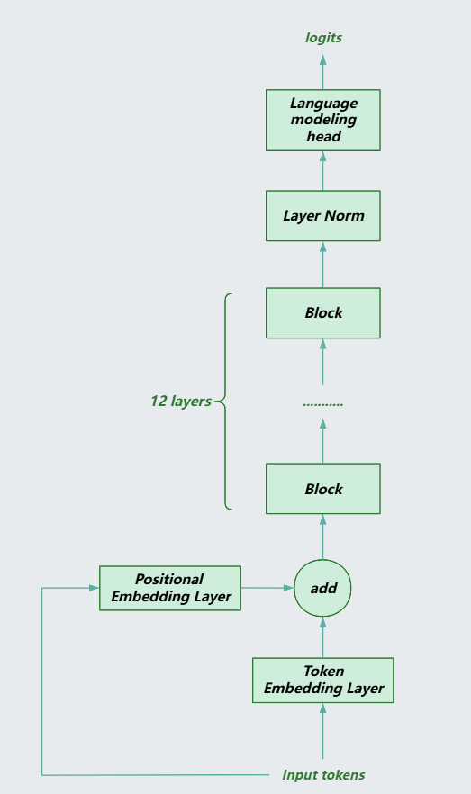
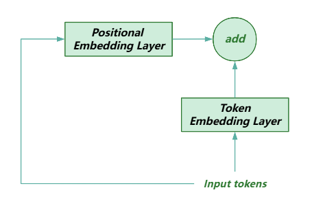
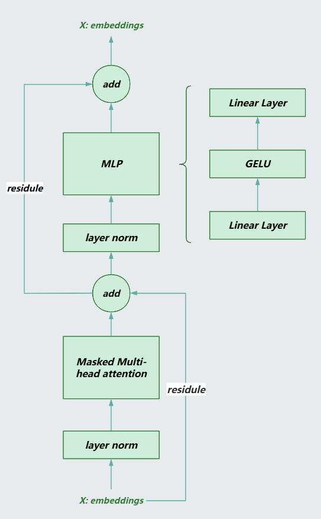
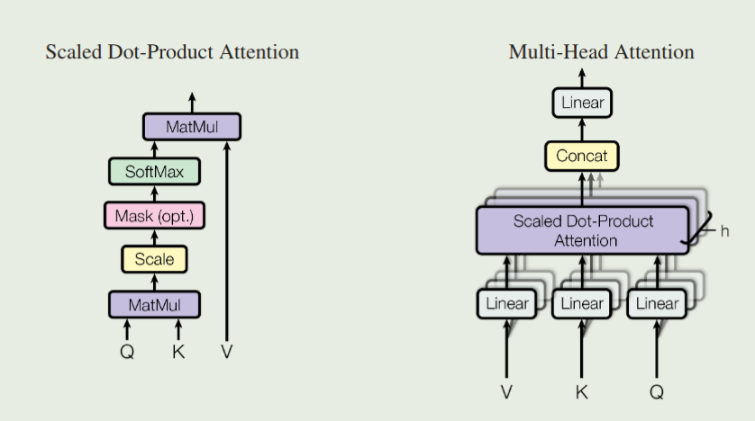
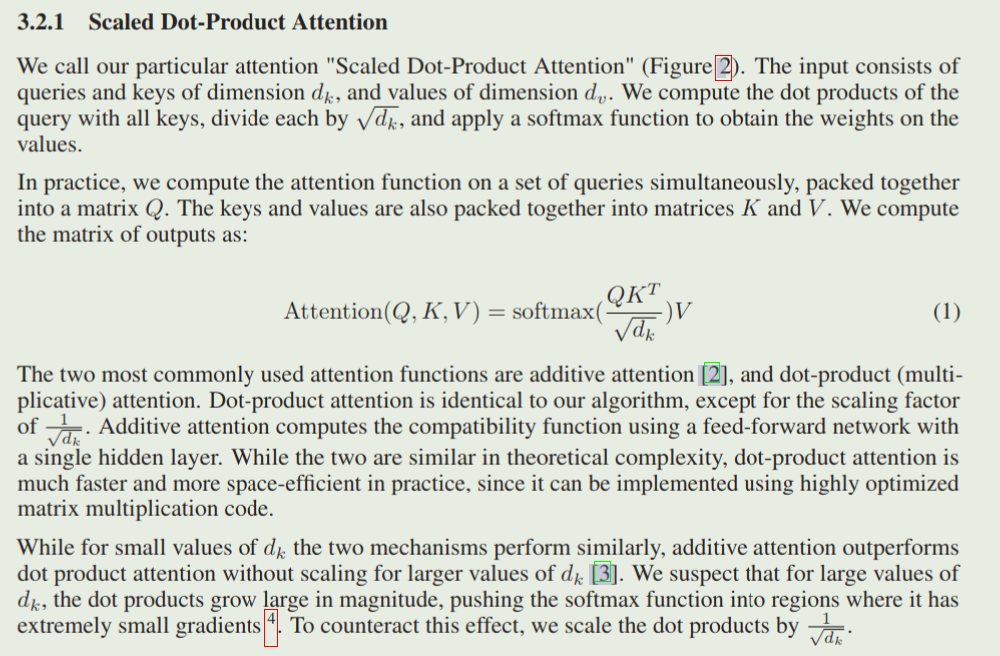

# Reproduce GPT2

## 1. Model Architecture
- Total architecture

### 1.1 embeddings
- 通过 token embedding layer 计算输入 tokens 的 embedding 
- 通过 position embedding layer 计算输入 tokens 的位置 embedding
- 将两个 embedding 直接相加, 得到最终的输入 embedding
- GPT2 中 embedding 的维度为 768, vocab_size 为 50257
- NOTE: position embedding 可以是训练的, 也可以是固定的, 固定的采用 (sin, cos) 对的方式


### 1.2 Block
- 为了避免将 residule 模块接入到模型中, 在 GPT2 中的 block 的设计中, 残差部分不通过 layer norm.
- 每一个 block 由两个残差块组成 
- GPT2 共有 12 个 blocks
- 每一个 block 保持输入输出的维度相同, [B, T, embd_size] -> [B, T, embd_size]


#### Masked Multi-head Attention
- Multi-head Q, K, V
  ```python
  self.attn = nn.Linear(embd_size, embd_size * 3)

  B, T, embd_size = x.shape
  q, k, v = self.attn(x).split(embd_size, dim=-1)
  q = q.view(B, T, self.n_head, embd_size // self.n_head).transpose(1, 2)
  k = k.view(B, T, self.n_head, embd_size // self.n_head).transpose(1, 2)
  v = v.view(B, T, self.n_head, embd_size // self.n_head).transpose(1, 2)
  ```
- Attention Mechanism
  
  
  ```python
  if self.flash:
    pass
  else:
    # NOTE - scale by d_k, 避免 attention 中的得分分布极度不均(e.g. [50, 1, 2, 0.5]), 导致经过 softmax 之后得到的梯度非常小
    attn = q @ k.transpose(-2, -1) * (1.0 / math.sqrt(k.size(-1)))  

    # NOTE - 将矩阵的上三角使用 -inf 填充, 后续经过 softmax 之后对应位置为 0, 即 attention score 为 0
    attn = attn.masked_fill(self.bias[:, :, :T, :T] == 0, float("-inf"))

    attn = F.softmax(attn, dim=-1)
    attn = self.attn_dropout(attn)
    out = attn @ v

  # concat multi-head
  v = out.transpose(1, 2).contiguous().view(B, T, embd_size)   
  # final linear layer
  v = self.c_proj(v)
  ```

### 1.3 LM_Head (Language Modeling Head)
- 经过所有 blocks 之后最后经过 LM_Head 将 hidden_state 转为 logits: [B, T, embd_size] -> [B, T, vocab_size]
- 本质就是一个 Linear Layer
- 在经过 LM_Head 之前需要先经过一个 Layer Norm


## 2. Inference and Training optimization
### 2.1 matmul_precision
- 使用 TF32 优化矩阵乘法: torch.set_float32_matmul_precision("high"), 如果使用 NVIDIA Ampere 架构, 则矩阵乘法时在内部会使用 TF32 数据类型加速计算. 如果不支持 TF32, 则使用 bf16 代替.
- NOTE: 只是在矩阵内部运算时隐式地将矩阵乘法改为 TF32 或者 bf16, 矩阵乘法的输入输出的数据类型保持不变.

### 2.2 automatic mixed precision
```python
# NOTE - In this context, use automatic mixed precision: transfer some tensor to bf16, which is faster than fp32
# NOTE - 不改变模型本身的参数, 而是改变用于计算时的参数, 并且允许输出时低精度的
# NOTE - 使用 bf16 而不使用 fp16, 因为 bf16 能够表示的范围比 fp16 更广 (range 由指数位决定, bf16的 range 几乎与 float32 的一致), 不容易产生下溢问题 (下溢: 当小于小数所能表示的最小数字时, 会变为0)
with torch.autocast("cuda", dtype=torch.bfloat16, enabled=use_amp): 
    logits, loss = model(x, y)
  
# NOTE - 反向传播不应该被包含在 autocast 中
loss.backward()
```
### 2.3 compile the model

### 2.4 use beautiful numbers (e.g. $2^n$)