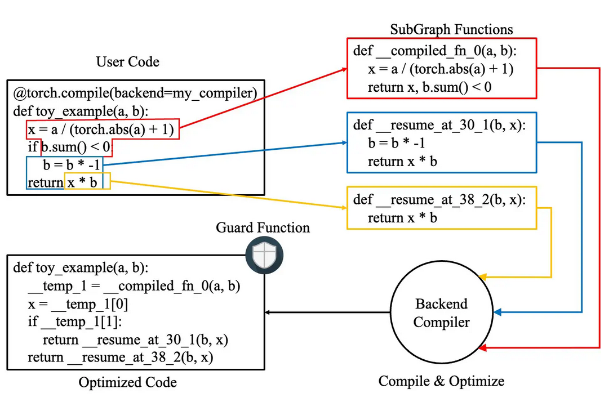
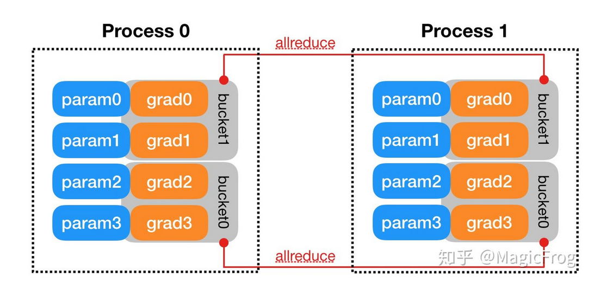

# Reproduce GPT2

## 1. Model Architecture
- Total architecture

### 1.1 embeddings
- 通过 token embedding layer 计算输入 tokens 的 embedding 
- 通过 position embedding layer 计算输入 tokens 的位置 embedding
- 将两个 embedding 直接相加, 得到最终的输入 embedding
- GPT2 中 embedding 的维度为 768, vocab_size 为 50257
- NOTE: position embedding 可以是训练的, 也可以是固定的, 固定的采用 (sin, cos) 对的方式


### 1.2 Block
- 为了避免将 residule 模块接入到模型中, 在 GPT2 中的 block 的设计中, 残差部分不通过 layer norm.
- 每一个 block 由两个残差块组成 
- GPT2 共有 12 个 blocks
- 每一个 block 保持输入输出的维度相同, [B, T, embd_size] -> [B, T, embd_size]


#### Masked Multi-head Attention
- Multi-head Q, K, V
  ```python
  self.attn = nn.Linear(embd_size, embd_size * 3)

  B, T, embd_size = x.shape
  q, k, v = self.attn(x).split(embd_size, dim=-1)
  q = q.view(B, T, self.n_head, embd_size // self.n_head).transpose(1, 2)
  k = k.view(B, T, self.n_head, embd_size // self.n_head).transpose(1, 2)
  v = v.view(B, T, self.n_head, embd_size // self.n_head).transpose(1, 2)
  ```
- Attention Mechanism
  
  
  ```python
  if self.flash:
    pass
  else:
    # NOTE - scale by d_k, 避免 attention 中的得分分布极度不均(e.g. [50, 1, 2, 0.5]), 导致经过 softmax 之后得到的梯度非常小
    attn = q @ k.transpose(-2, -1) * (1.0 / math.sqrt(k.size(-1)))  

    # NOTE - 将矩阵的上三角使用 -inf 填充, 后续经过 softmax 之后对应位置为 0, 即 attention score 为 0
    attn = attn.masked_fill(self.bias[:, :, :T, :T] == 0, float("-inf"))

    attn = F.softmax(attn, dim=-1)
    attn = self.attn_dropout(attn)
    out = attn @ v

  # concat multi-head
  v = out.transpose(1, 2).contiguous().view(B, T, embd_size)   
  # final linear layer
  v = self.c_proj(v)
  ```

### 1.3 LM_Head (Language Modeling Head)
- 经过所有 blocks 之后最后经过 LM_Head 将 hidden_state 转为 logits: [B, T, embd_size] -> [B, T, vocab_size]
- 本质就是一个 Linear Layer
- 在经过 LM_Head 之前需要先经过一个 Layer Norm


## 2. Inference and Training optimization
### 2.1 matmul_precision
- 使用 TF32 优化矩阵乘法: torch.set_float32_matmul_precision("high"), 如果使用 NVIDIA Ampere 架构, 则矩阵乘法时在内部会使用 TF32 数据类型加速计算. 如果不支持 TF32, 则使用 bf16 代替.
- NOTE: 只是在矩阵内部运算时隐式地将矩阵乘法改为 TF32 或者 bf16, 矩阵乘法的输入输出的数据类型保持不变.

### 2.2 automatic mixed precision
```python
# NOTE - In this context, use automatic mixed precision: transfer some tensor to bf16, which is faster than fp32
# NOTE - 不改变模型本身的参数, 而是改变用于计算时的参数, 并且允许输出时低精度的
# NOTE - 使用 bf16 而不使用 fp16, 因为 bf16 能够表示的范围比 fp16 更广 (range 由指数位决定, bf16的 range 几乎与 float32 的一致), 不容易产生下溢问题 (下溢: 当小于小数所能表示的最小数字时, 会变为0)
with torch.autocast("cuda", dtype=torch.bfloat16, enabled=use_amp): 
    logits, loss = model(x, y)
  
# NOTE - 反向传播不应该被包含在 autocast 中
loss.backward()
```
### 2.3 compile the model
#### usage
```python
model = torch.compile(model)
```

#### torch.compile原理
- step1: 使用 dynamo 将 python 字节码转为 FX graphs. 如果代码中有地方有多分支结构(if), 或者需要依赖于某个变量的状态(while), 则会有多个 FX graphs, 不利于后续的优化. 因此, 使用 PyTorch style 的代码而不是 python 风格的代码.
- step2: TODO 


### 2.4 use beautiful numbers (e.g. $2^n$)
尽量使用 $2^n$ 这种形式的数字, 因为 GPU 在处理2的幂这样的数据时更加高效. 另外一些其他的 infra 也在 $2^n$ 时更加高效.

### 2.5 Accumulated Gradient
当时用很大的 batch size, 但是由于 batch size 过大无法直接处理全部, 则可以使用 accumulate gradient 的方式对梯度进行累积.
e.g. GPT2 训练时 batch size ~ 5M tokens, 本地训练时将大的 batch 分为 K 个小 batch, 模型每次处理一个小 batch, 然后 loss.backward() 将梯度在模型的参数上进行累积, 直到处理完第 K 个小 batch 之后, 模型参数更新一次.
```python
for micro_step in range(accum_steps):
  x, y = train_loader.next_batch()
  x, y = x.to(device), y.to(device)

  with torch.autocast("cuda", dtype=torch.bfloat16, enabled=use_amp):
    logits, loss = model(x, y)
  
  # NOTE - Accumulated gradient 时需要确保 loss 也满足平均值
  loss *= 1.0 / accum_steps
  
  # NOTE - DDP 在进行 accumulated gradient 时, 只有最后一步需要对不同GPU上的模型的梯度进行同步, 否则每个 micro_step 都进行同步浪费时间, 没有必要
  if ddp: 
    model.require_backward_grad_sync = (micro_step == accum_steps - 1)

  # NOTE - 如果 DDP 并且 require_backward_grad_sync == True, 则在 loss 回传时, 每一个卡上模型的梯度会通过 Ring-AllReduce 进行同步
  loss.backward()
```

### 2.6 Clip Grads
- norm based 梯度裁减: 防止梯度爆炸, 限制模型的梯度的 norm 在 max_norm 之内, 否则按照比例对 model 上的梯度进行缩小 K(K = max_norm / norm(grad))倍.
```python
torch.nn.utils.clip_grad_norm_(model.parameters(), max_norm=1.0, norm_type=norm_type)
```

### 2.6 Distributed Data Parallel
- Data Parallel: 总共只有一个进程, master 节点收集到各个卡中计算的梯度, 取平均值之后更新其模型参数, 其他卡拉取 master 节点中的参数进行更新
    - 负载不均衡: device[0] 负载大一些
    - 通信开销与GPU数量线性相关: 假设有 K 个GPU, 完成一次通信需要$P/b$时间, 使用PS算法, 总共需要花费$T = 2(k-1)P/b$
    - 单进程: 收到 python GIL 约束, 一个 python 进程只能使用一个 CPU kernel, 多线程并发时, 只能执行一个线程.
- Distributed Data Parallel: 多个进程, 每个进程对应一个卡, 每个进程都计算一个 batch, 在 loss.backward()(默认是阻塞的, 即当所有的进程触发 layer-hook 时, 在该 layer 上所有进程的梯度进行 All-Reduce 同步) 时, 使用 Ring-AllReduce 进行梯度同步, 此时每一张卡上的梯度都积累了相同的值, 再每一个进程各自调用自己的 optimizer.step() 更新自己的模型的参数.

- Accumulated Gradients: 在使用DDP时, 如果同时使用 accumulated grads 技巧, 则不必要每一个 micro_step 的 loss 都需要进行同步, 只需要在模型更新参数之前保证梯度同步即可.
```python
# NOTE - DDP 在进行 accumulated gradient 时, 只有最后一步需要对不同GPU上的模型的梯度进行同步, 否则每个 micro_step 都进行同步浪费时间, 没有必要
if ddp: 
  model.require_backward_grad_sync = (micro_step == accum_steps - 1)
```

- Distributed Data Sampler: 每一个进程需要保证模型得到的训练数据不同, 否则在一次更新中, 同样的数据被使用了多次, 相当于这条数据的贡献会较其他的数据大, 导致模型学习出现偏差 

## 3. Tokenizer
### BPE - GPT2 tokenizer